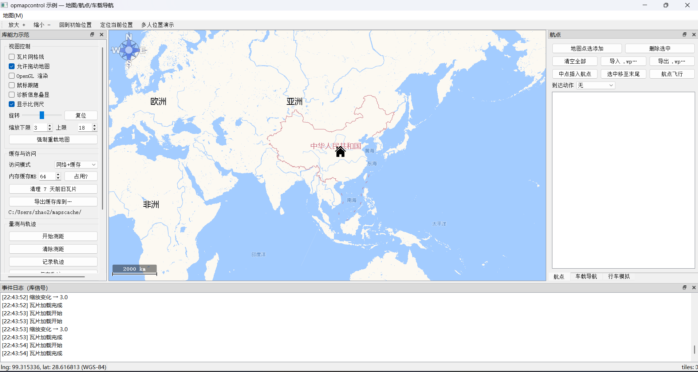
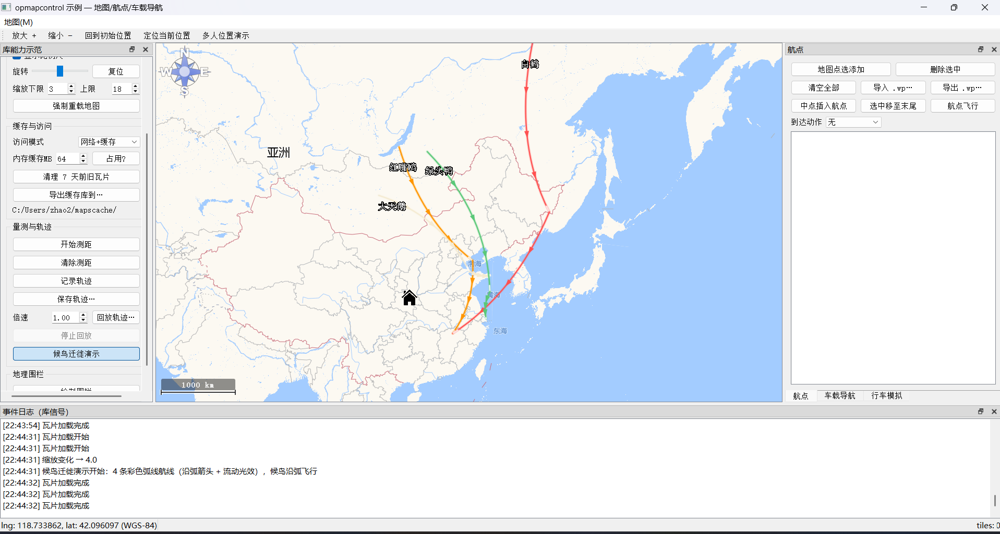
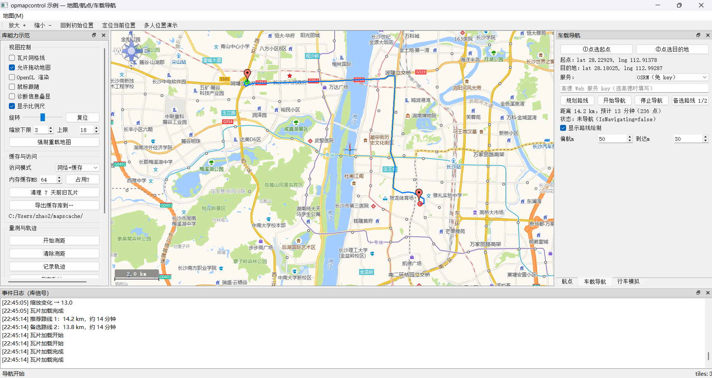

# opmapcontrol_ex

基于 OpenPilot GCS `opmapcontrol` 的 Qt 地图控件库，已重构迁移至 **Qt 5.12**，并重组为分层架构。支持多地图源切换、WGS-84 坐标自动纠偏、瓦片三级缓存与离线地图下载，内置 UAV 位置显示与航点编辑能力，附完整 example。

## 特性

- **多地图源**：高德（路网/卫星/标注/混合）、OpenStreetMap、ArcGIS（地图/卫星/地形）、Google（地图/卫星/地形/混合）
- **坐标系自动纠偏**：用户坐标统一使用 WGS-84，控件根据地图源声明的瓦片坐标系（GCJ-02/WGS-84）在投影边界自动转换，鼠标读出的经纬度始终为 WGS-84
- **瓦片三级缓存**：内存 LRU 缓存 → SQLite 磁盘缓存 → 网络下载，离线数据与在线浏览共用同一缓存
- **离线下载**：框选区域后一键抓取指定缩放级别的全部瓦片
- **地图元素**：UAV 位置/航迹、航点（增删改/导入导出）、Home 点、GPS 轨迹
- **界面可配置**：网格线显示、缩放范围、旋转、空瓦片样式、内存缓存容量等

## 目录结构

```
src/
├── ui/          Qt 界面控件（OPMapWidget 及地图元素 item）
├── engine/      地图引擎（MapService 组合服务 / MapEngine 加载调度 / 瓦片矩阵 / 投影）
├── providers/   地图源（MapType 枚举 / UrlFactory / 语言与版本串）
├── cache/       瓦片缓存（内存 LRU / SQLite 磁盘缓存 / 下载队列）
└── platform/    基础类型（几何点/矩形、坐标系转换、诊断）
```

依赖方向自上而下单向传递：`ui → engine → providers + cache → platform`。外部程序只需包含 `src/opmapcontrol.h`。

## 文档

- [实现原理](doc/architecture.md) — 分层架构、瓦片加载流程、三级缓存、坐标系纠偏、投影与离线下载原理、扩展指南
- [功能清单与 API 参考](doc/features.md) — 库全部公开能力按模块整理，并标注 example 是否演示

## 构建

依赖：Qt 5.12（需 core gui widgets network sql svg opengl 模块）、MinGW（Windows）或 GCC（Linux）。地图瓦片下载使用 HTTPS，Windows 下需要 OpenSSL 运行库（example/demo 目录已附带 `libssl-1_1-x64.dll` / `libcrypto-1_1-x64.dll`）。

```bash
# 编译静态库
qmake opmapcontrol.pro
mingw32-make        # Linux 下为 make

# 编译 example
cd example/demo
qmake demo.pro
mingw32-make
```

构建中间产物（moc/uic/rcc/目标文件）统一输出到 `build/` 目录，静态库输出为根目录的 `libopmapwidget.a`。

## 运行 example

```bash
# 需保证 Qt 的 bin 目录在 PATH 中（DLL 依赖），例如：
# set PATH=C:\Qt\Qt5.12.12\5.12.12\mingw73_64\bin;%PATH%
opmapcontrol_example.exe
```

- 拖动/滚轮缩放浏览地图，鼠标读数为 WGS-84 经纬度
- 右键菜单：切换地图类型 / Access Type / 航点增删改
- 框选区域后点击 `Cache map` 下载离线瓦片；重启程序后命中缓存，不再联网
- 地图类型等初始配置位于 `example/demo/data/demo.ini`

## 集成到自己的项目

1. `.pro` 中添加 `INCLUDEPATH`（指向 `src/` 及各子目录）并链接 `libopmapwidget.a`
2. 包含 `opmapcontrol.h`，创建 widget：

```cpp
#include "opmapcontrol.h"

OPMapWidget *map = new OPMapWidget(this);

map->SetMapType(opmap::MapType::AutoNaviRoad);      // 地图源
map->SetCurrentPosition(opmap::PointLatLng(30.66, 104.06)); // WGS-84 经纬度
map->SetZoom(10);

// 离线下载：框选区域（SelectedArea）后抓取当前级别瓦片
map->RipMap();
```

注意：`MapType::Types` 的枚举数值与磁盘缓存索引绑定，请勿修改数值或调整顺序，否则已缓存瓦片无法命中。

## 地图源与坐标系

每个地图源在 `UrlFactory` 中声明对应的瓦片坐标系（`MapType::TileDatum`）：

| 坐标系 | 地图源 | 说明 |
|--------|--------|------|
| WGS-84 | OpenStreetMap、ArcGIS、Google | 无需纠偏 |
| GCJ-02 | 高德（AutoNavi*） | 国内火星坐标，控件在投影边界自动与 WGS-84 互转 |

新增地图源时：在 `MapType::Types` 添加枚举值，在 `UrlFactory` 的 URL 工厂添加对应 case，并在 `DatumByType()` 中声明其坐标系，控件即可自动完成纠偏。

## 缓存机制

| 层级 | 位置 | 说明 |
|------|------|------|
| 内存缓存 | LRU 链表 | 容量可配（`Configuration::SetTileMemorySize`），超出自动淘汰 |
| 磁盘缓存 | SQLite 数据库 | 按（地图类型, 缩放级别, x, y）索引，Tile 字段存原始图片字节；example 默认 `example/demo/data/OPMaps.qmdb` |
| 网络下载 | UrlFactory | 支持 HTTPS 与重定向跟随，仅前两层未命中时触发 |

## 截图







## 许可证

本项目基于 GNU GPL v3 协议发布，原始代码版权归 [OpenPilot Project](http://www.openpilot.org) 所有。
